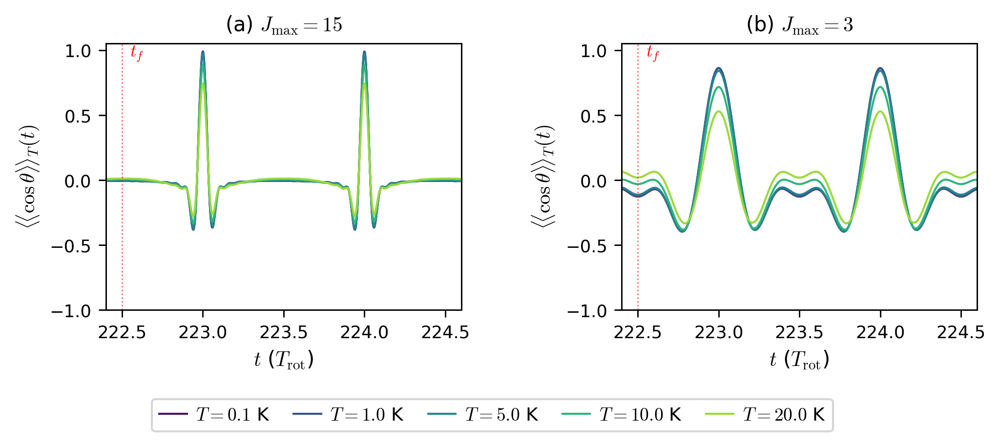
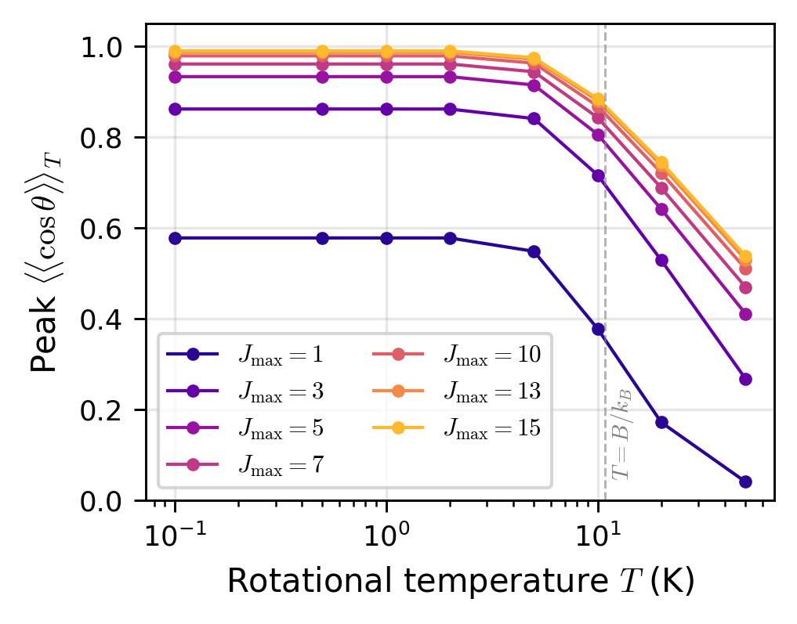
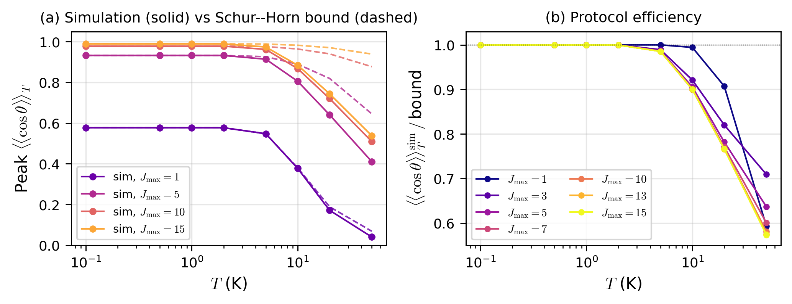
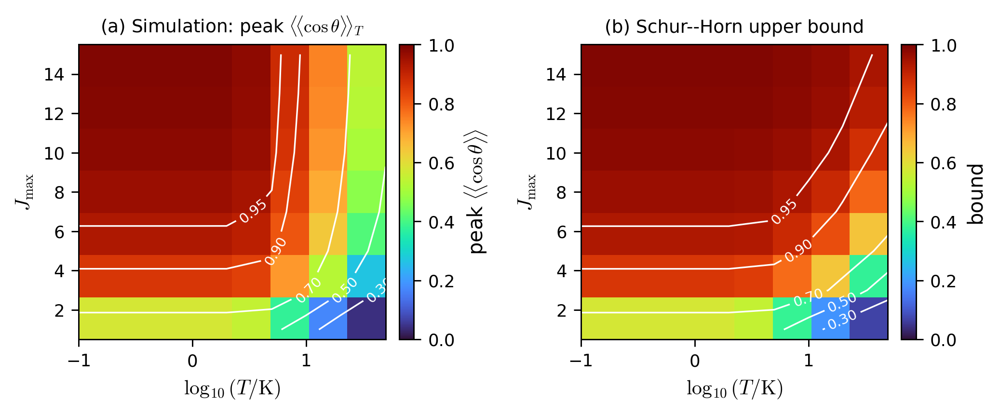

# Schur–Horn bound on thermal molecular orientation by *N*-subpulse control

[](https://doi.org/10.5281/zenodo.20321681)
[](https://opensource.org/licenses/MIT)
[](https://creativecommons.org/licenses/by/4.0/)
[](https://www.python.org/downloads/)

Companion code, data, and figures for the manuscript

> **T. Ahmad**, *A Schur–Horn bound on thermal molecular orientation by N-subpulse control*, submitted to **SciPost Physics Core** (2026).

This repository derives and verifies a **parameter-free analytical upper bound** on the maximum thermally averaged orientation $\langle\!\langle\cos\theta\rangle\!\rangle_T$ achievable by any *M*-conserving unitary control within a fixed truncated rotational subspace, and uses it to characterise the regime of validity of the analytical *N*-subpulse protocol of Hong *et al.* (Phys. Rev. Res. **7**, L012049, 2025) on LiH.

---

## Key results at a glance

| Temperature regime | Behaviour | Number |
|---|---|---|
| $T \le 2$ K | protocol saturates the bound | to **one part in 10⁴** |
| $T = 5$ K | gap to the bound opens | **1.5 %** |
| $T = 10$ K | gap widens | **~10 %** |
| $T = 50$ K, $J_{\max} \ge 10$ | bound-limited regime | **40 %** shortfall |
| Pulse-area retuning at $T=10$ K | gap closure | only **3–7 %** |

The third row identifies the **rigidity of the equal-width, equal-spacing pulse layout** — not the pulse-area choice — as the dominant obstacle to thermal optimality.

---

## Figures (paper, reproduced from this code)

<table>
<tr>
<td width="50%"></td>
<td width="50%"></td>
</tr>
<tr>
<td><em>Fig. 1 — Thermal field-free orientation traces for the $N$-subpulse protocol on LiH at temperatures 0.1, 1, 5, 10, 20 K. Two pulse-design subspaces ($J_{\max} = 15$ and $J_{\max} = 3$) are compared.</em></td>
<td><em>Fig. 2 — Peak thermal orientation vs. rotational temperature for seven pulse-design subspaces. The dashed line marks the characteristic scale $T = B/k_B \approx 10.8$ K.</em></td>
</tr>
<tr>
<td></td>
<td></td>
</tr>
<tr>
<td><em>Fig. 3 — Simulated peak thermal orientation (solid) compared to the analytical Schur–Horn upper bound (dashed) across temperature and $J_{\max}$.</em></td>
<td><em>Fig. 4 — Operability map in the $(J_{\max}, T)$ plane. White contours mark iso-orientation levels 0.30, 0.50, 0.70, 0.90, 0.95.</em></td>
</tr>
</table>

---

## Repository layout

```
.
├── README.md               this file
├── LICENSE                 MIT (code) + CC-BY-4.0 (data/figures) — see file
├── CITATION.cff            machine-readable citation metadata
├── requirements.txt        Python dependencies (numpy, scipy)
├── .gitignore              Python-standard
├── code/
│   ├── thermally_aware_redesign.py   optimisation core
│   └── run_redesign_sweep.py         driver script
├── data/
│   └── optimised_results.pkl         pickled output (rows of Table 2)
├── figures/
│   ├── fig_thermal_traces.png        Fig. 1 of the manuscript
│   ├── fig_peak_vs_T.png             Fig. 2
│   ├── fig_bound_vs_sim.png          Fig. 3
│   └── fig_operability.png           Fig. 4
└── docs/
    └── reproduction_notes.md         what reproduces, what's not bundled
```

---

## Quickstart

### 1. Clone

```bash
git clone https://github.com/<your-username>/schur-horn-thermal-orientation.git
cd schur-horn-thermal-orientation
```

### 2. Install dependencies

```bash
pip install -r requirements.txt
```

(NumPy ≥ 1.21, SciPy ≥ 1.7 — that's all. No GPU, no specialised libraries.)

### 3. Inspect the bundled optimisation results

```python
import pickle
with open('data/optimised_results.pkl', 'rb') as f:
    results = pickle.load(f)

# results is a dict keyed by (Jmax, T_K) tuples; each value contains
# baseline thermal peak, optimised areas, optimised peak, Schur–Horn bound.
for key, val in results.items():
    print(key, val)
```

### 4. (Optional) Re-run the optimisation sweep

The two helper modules `thermal_simulation.py` and `schur_horn_bound.py` referenced by `code/thermally_aware_redesign.py` are **not bundled in this minimal repository** — they are part of the author's larger working directory. Both modules are fully specified in the manuscript:

- `thermal_simulation.py` ↔ Section 2 (Hamiltonian, pulse train) + Appendix A (Strang split-operator integration in matrix form per *M*-sector).
- `schur_horn_bound.py` ↔ Equations (8)–(10) of the manuscript, the rearrangement-inequality bound summed across *M*-sectors.

Each is roughly 100 lines of NumPy. If you would like the full simulation directory, [open an issue](../../issues) or email the author (below) — happy to share.

Once both modules are in `code/`, run:

```bash
cd code/
python run_redesign_sweep.py
```

Runtime: ~5–20 min per (*J*ₘₐₓ, *T*) case on a single CPU.

---

## What this repository does and does not reproduce

| | Status |
|---|---|
| **Table 2** (numerical optimisation of pulse areas within the analytical layout at $T = 10$ K) | ✅ Reproduced — `data/optimised_results.pkl` contains the row values; `code/` regenerates them given the two helper modules. |
| **Figures 1–4** (PNG, as published) | ✅ Bundled in `figures/`. |
| **Table 1** (8-test verification suite for the $T = 0$ analytical baseline) | 🔲 Not in this minimal bundle — reproducible from the manuscript text once `thermal_simulation.py` is rebuilt. |
| **Figure-data CSVs** | 🔲 Not bundled (only the rendered PNGs). Available on request. |

---

## How to cite

If you use this code or its results, please cite both the manuscript and this repository.

### The manuscript

```bibtex
@article{ahmad2026schurhorn,
  author  = {T. Ahmad},
  title   = {A {Schur--Horn} bound on thermal molecular orientation by {$N$}-subpulse control},
  journal = {SciPost Physics Core},
  year    = {2026},
  note    = {Submitted}
}
```

*This entry will be updated with volume, page, and DOI once the paper is published.*

### This repository / Zenodo deposit

```bibtex
@misc{ahmad2026data,
  author    = {T. Ahmad},
  title     = {Simulation code and data for ``A {Schur--Horn} bound on thermal molecular orientation by {$N$}-subpulse control''},
  publisher = {Zenodo},
  year      = {2026},
  doi       = {10.5281/zenodo.20321681}
}
```

GitHub's **Cite this repository** button (top-right of the repo page) will also produce these entries automatically from the `CITATION.cff` file.

---

## License

| Artifact | License |
|---|---|
| Code (`code/*.py`) | MIT — see [LICENSE](LICENSE) |
| Data (`data/*.pkl`) | CC BY 4.0 — see [LICENSE](LICENSE) |
| Figures (`figures/*.png`) | CC BY 4.0 — see [LICENSE](LICENSE) |

The LICENSE file documents the dual-licensing explicitly. The MIT badge above reflects the primary code license, the CC-BY-4.0 badge reflects the data/figure license.

---

## Underlying physics — one-paragraph summary

The Schur–Horn (rearrangement) inequality states that the trace of a product of two Hermitian operators is maximised, over unitaries acting on one of them, when their eigenvectors are aligned in matching decreasing order. Applied per *M*-sector to a Boltzmann state $\rho_M(T)$ and the restricted operator $C_M = [\cos\theta]_M$, and summed across sectors with the rotational partition function, this gives a parameter-free upper bound on the thermally averaged orientation achievable by *any* single-pulse-train *M*-conserving unitary control. The bound recovers the eigenvalue of Hong *et al.* at $T \to 0$ and decreases monotonically with $T$. On LiH driven by their analytical 15-subpulse protocol, the bound is saturated to one part in 10⁴ below 2 K, but a residual gap of 10–40% opens up above the characteristic temperature $T \sim B/k_B \approx 10.8$ K — and direct numerical optimisation of the pulse areas inside the analytical layout closes only 3–7% of that gap, identifying the *layout* itself (equal-width, equal-spacing Gaussian subpulses with resonant carriers) as the dominant obstacle to thermal optimality.

---

## Contact

**Tanveer Ahmad** — Independent Researcher
📧 tanveer.quantum@gmail.com

For questions about the code, the full simulation directory, or potential collaborations, open an issue here or send an email.

---

## Acknowledgments

This work builds on the analytical *N*-subpulse construction of Hong *et al.*, Phys. Rev. Research **7**, L012049 (2025), arXiv:2502.10196.

The numerical work uses the open-source scientific Python ecosystem (NumPy, SciPy, Matplotlib).
